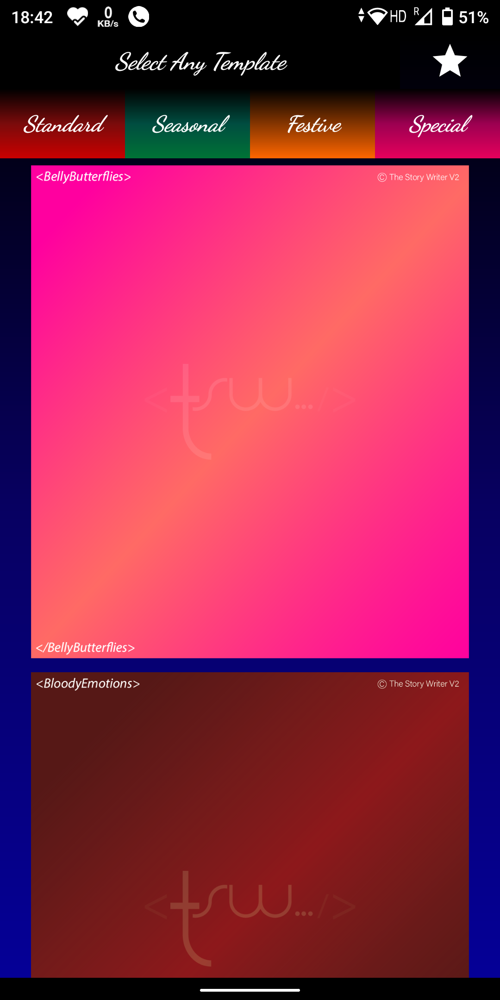
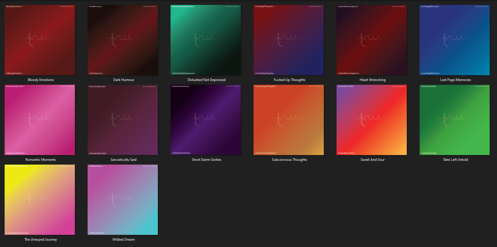
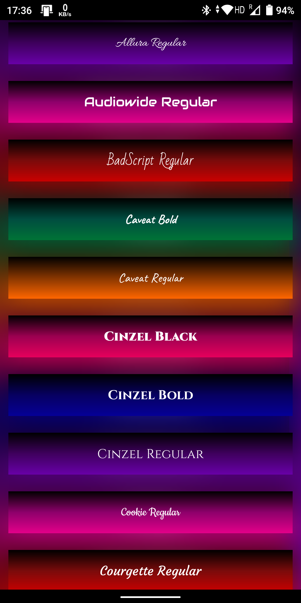
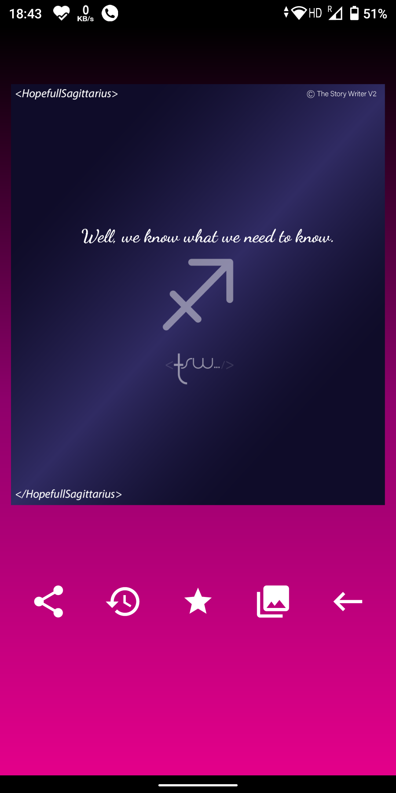

# TheStoryWriter-V2
Version 2 of the OG [The Story Writer](https://github.com/Projit32/TheStoryWriter) app but revamped!

`Code : 100% Kotlin`  
Try out the app from [Play Store](https://play.google.com/store/apps/details?id=com.prolabs.thestorywriter)

Just like the previous one, you'll be able to bring your thoughts into a frame, but there's more to it this time.

* Templates are haveing a wide variety of selection this time and are in *__Gradient__*.
All the templates are cloud synced so, you can have the latest templates anytime.

* The Editor is Amped up. Now, you have *vertical & horizontal movements* , *100+ Fonts*, *Signature Support* and *text size adjustments*.

* Direct share integration

* And at last, All your previous stories will be saved, so you can pick up from wherever you left.

